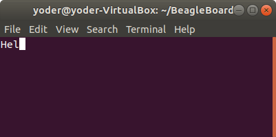
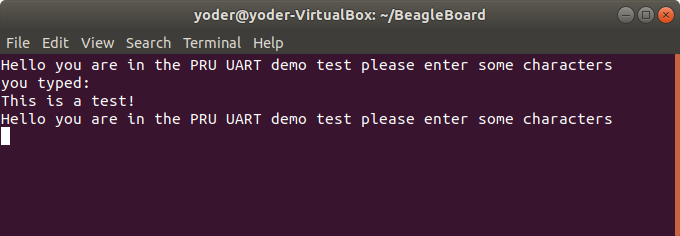

## Debugging and Benchmarking

Here's where we learn how to debug. On of the challenges is getting debug
information out without slowing the real-time execution.

### LED and switch for debugging
### Oscilloscope
### dmesg –Hw

#### Problem
I'm getting an error message (`/sys/devices/platform/ocp/4a326000.pruss-soc-bus/4a300000.pruss/4a334000.pru0/remoteproc/remoteproc1/state: Invalid argument`)
when I load my code, but don't know what's causing it.

#### Solution
The command `dmesg` outputs usefull information when dealing with the kernel.
Simplying running `dmesg -H` can tell you a lot.  The `-H` flag puts the
dates in the human readable for.  Often I'll have a window open running `dmesg -Hw`;
the `-w` tells it to wait for more information.

Here's what `dmesg` said for the example above.

```
[  +0.000018] remoteproc remoteproc1: header-less resource table
[  +0.011879] remoteproc remoteproc1: Failed to find resource table
[  +0.008770] remoteproc remoteproc1: Boot failed: -22
```
It quickly told me I needed to add the line `#include "resource_table_empty.h"`
to my code.

### prubug?
### UART

#### Problem
I'd like to use something like `printf()` to debug my code.

#### Solution
One simple, yet effective approach to 'printing' from the PRU is
an idea taken from the Adruino playbook; 
use the UART (serial port) to output debug information.  The PRU has it's
own UART that can send characters to a serial port.

#### Discussion
Two examples of using the UART are presented here.  The first (`uart1.c`) Sends
a character out the serial port then waits for a character to come in.  Once
the new character arrives another character is output.

The second example (`uart2.c`) prints out a string and then waits for characters to arrive.
Once an ENTER appears the string is sent back.

For either of these you will need to set the pin muxes.

```bash
# Configure tx
config-pin P9_24 pru_uart
# Configure rx
config-pin P9_26 pru_uart
```

TODO:  Add code for Blue and Pocket

###### uart1.c
Set the following variables so `make` will know what to compile.
````bash
export PRUN=0
export TARGET=uart1
make
````
Now `make` will compile, load PRU0 and start it.  In a terminal window run
```bash
screen /dev/ttyUSB0 115200
```
It will initially display the first charters (`H`) and then as you enter
characters on the keyboard, the rest of the message will appear.



Here's the code (`uart1.c`) that does it.

```c

```
The first part of the code initializes the UART. Then the line `CT_UART.THR = tx;`
takes a character in `tx` and sends it to the transmit buffer on the UART.
Think of this as the UART version of the `printf()`. 

Later the line `while (!((CT_UART.FCR & 0x2) == 0x2));`
waits for the transmit FIFO to be empty.  This makes sure later characters
won't overwrite the buffer before they can be sent.  The downside is, this will
cause your code to wait on the buffer and it might miss an important 
real-time event.

The line `while ((CT_UART.LSR & 0x1) == 0x0);` waits for an input from the 
UART (possibly missing something) and `rx = CT_UART.RBR;` reads from the
receive register on the UART.

These simple lines should be enough to place in your code to print out
debugging information.

##### uart2.c
If you want to try `uart2.c`, run the following:
````bash
export PRUN=0
export TARGET=uart2
make
````
You will see:


Type a few characters and hit ENTER.  The PRU will playback what you typed,
but it won't echo it as you type.

`uart2.c` defines `PrintMessageOut()` which is passed a string that is
sent to the UART. It take advantage of the eight character FIFO on the UART.
Be careful using it because it also uses `while (!CT_UART.LSR_bit.TEMT);` to
wait for the FIFO to empty, which may cause your code to miss something.

Here's the code (`uart1.c`) that does it.

```c

```
