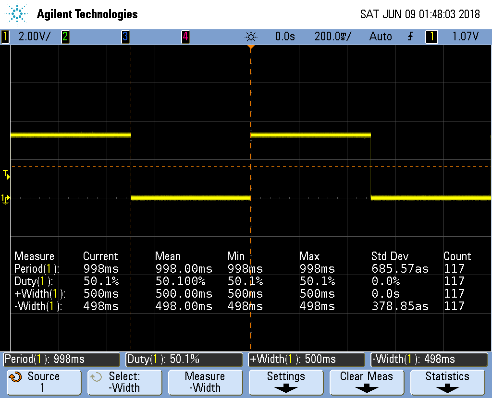
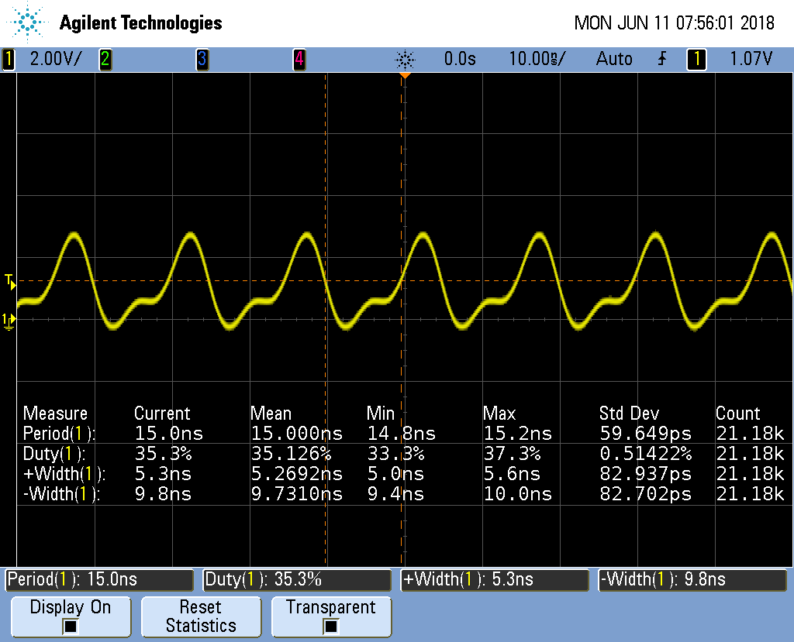

## Building Blocks - Applications

Here are some examples that use the basic PRU building blocks.

### PWM generator
One of the simplest things a PRU can to is generate a simple
**p**ulse **w**idth **m**odulated signal.  Here we'll solve a series of
problems starting with a single channel PWM that has a fixed frequency and
duty cycle and ending with a multi channel PWM that the ARM can change
the frequency and duty cycle on the fly.

#### Problem
I want to generate a PWM signal that has a fixed frequency and duty cycle.

#### Solution
The solution is fairly easy, but be sure to check the **Discussion** section
for details on making it work.

Here's the code (`pwm1.c`).

```c

```

#### Discussion
Since this is our first example we'll discuss the many parts in detail.
##### pwm1.c
Here's a line-by-line expanation of the c code.

|Line|Explantion|
|----|----------|
|1   |Standard c-header include|
|2   |Include for the PRU.  The compiler know where to find this since the Makefile says to look for includes in `/usr/lib/ti/pru-software-support-package`|
|3   |The file `resource_table_empty.h` is used by the PRU loader.  Generally we'll use the same file, but don't need to modify it.|

Here's what's in `resource_table_empty.h`
```c

```

|Line|Explantion|
|----|----------|
|5-6 |`__R30` and `__R31` are two variables that refer to the PRU output (`__R30`) and input (`__R31`) registers. When you write something to `__R30` it will show up on the corresponding output pins.  When you read from `__RR31` you read the data on the input pins.  NOTE:  Both names begin with two underscore's. Section 5.7.2 of the [PRU Optimizing C/C++ Compiler, v2.2, User's Guide](http://www.ti.com/lit/ug/spruhv7b/spruhv7b.pdf) gives more details.|
|13    |`CT_CFG.SYSCFG_bit.STANDBY_INIT` is set to `0` to enable the OCP master port. More details on this and thousands of other regesters see the [AM335x Technical Reference Manual](https://www.ti.com/lit/ug/spruh73p/spruh73p.pdf). Section 4 is on the PRU and section 4.5 gives details for all the registers.|
|15    |This line selects which GPIO pin to toggle.  The table below shows which bits in `__R30` map to which pins|

Bit 0 is the LSB.

|PRU|Bit|Black pin|Blue pin|Pocket pin|
|---|---|---------|--------|----------|
|0  |0  |P9_31    |        |P1.16     |
|0  |1  |P9_29    |        |P1.33     |
|0  |2  |P9_30    |        |P2.32     |
|0  |3  |P9_28    |        |P2.30     |
|0  |4  |P9_92    |        |P1.31     |
|0  |5  |P9_27    |        |P2.34     |
|0  |6  |P9_91    |        |P2.28     |
|0  |7  |P9_25    |        |P1.29     |
|0  |14 |P8_12    |        |P2.24     |
|0  |15 |P8_11    |        |P2.33     |
|---|---|---------|--------|----------|
|1  |0  |P8_45    |        |          |
|1  |1  |P8_46    |        |          |
|1  |2  |P8_43    |        |          |
|1  |3  |P8_44    |        |          |
|1  |4  |P8_41    |        |          |
|1  |5  |P8_42    |        |          |
|1  |6  |P8_39    |        |          |
|1  |7  |P8_40    |        |          |
|1  |8  |P8_27    |        |P2.35     |
|1  |9  |P8_29    |        |P2.01     |
|1  |10 |P8_28    |        |P1.35     |
|1  |11 |P8_30    |        |P1.04     |
|1  |12 |P8_21    |        |          |
|1  |13 |P8_20    |        |          |
|1  |14 |         |        |P1.32     |
|1  |15 |         |        |P1.30     |

Since we are running on PRU 0 we're using `0x0001`, that is bit 1, we'll be toggling `P9_31`.

|Line|Explantion|
|----|----------|
|18  |Here is where the action is.  This line reads `__R30` and then exclusive-or's it with `gpio`, flipping the bits where there is a 1 in `gpio` and leaving the bits where there is a 0.  Thus we are toggling the bit we selected. Finally the new value is written back to `__R30`. |
|19  |`__delay_cycles` is an instrinsic function that delays with number of cycles passed to it. (You can read more about instrinsics in section 5.11 of the [PRU Optimizing C/C++ Compiler, v2.2, User's Guide](http://www.ti.com/lit/ug/spruhv7b/spruhv7b.pdf).) Each cycle is 5ns, and we are delaying 100,000,000 cycles which is 500,000,000ns, or 0.5 seconds. |

When you run this code and look at the output you will see something like the following figure.



Notice the on time (`+Width(1)`) is 500ms, just as we predicted.  The off time is 498ms, which is only 2ms off from our prediction.  The standard deviation is 0, or only 380as, which is 380 times 10 to the -18!.

You can see how fast the PRU and run by setting the delay time to 0. This results in the next figure.



Notice the period is 20.1ns which gives us a frequency of about 50MHz.  The on time is 10.2ns and the off time is 10ns.  This means the compiler was able to implement the while loop in just two 5ns instructions!  Not bad.

### Sine Wave Generator
### Ultrasonic Sensor Application
### neoPixel driver
